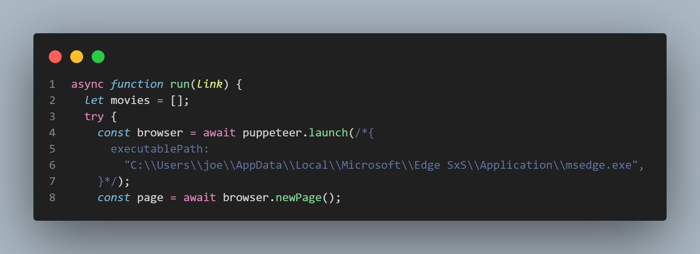
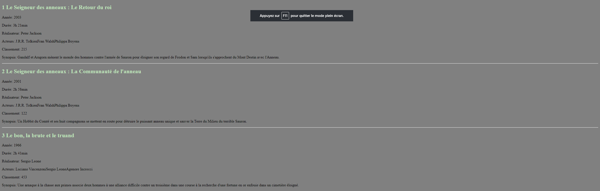
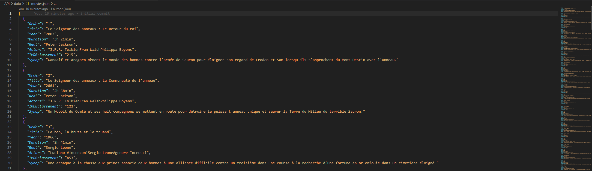
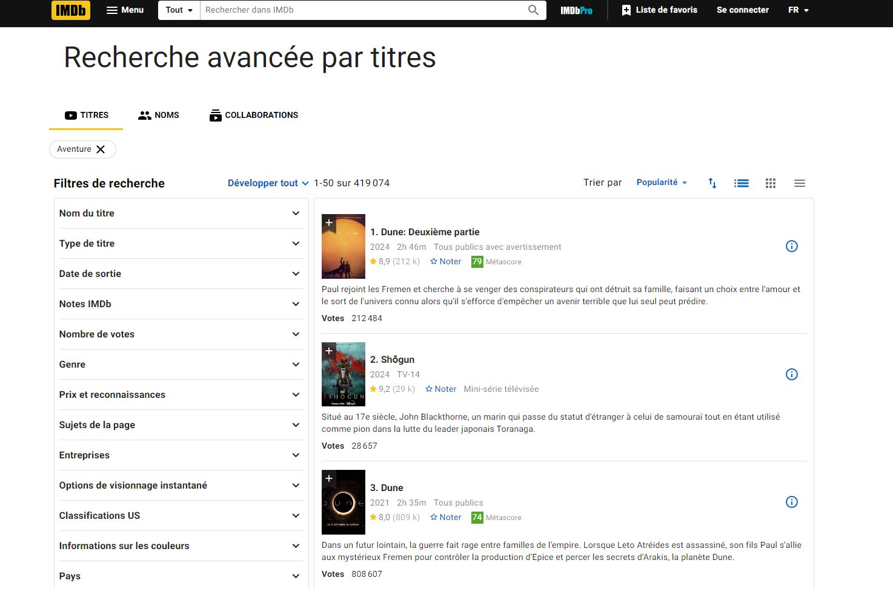

# Welcome on my scraping project, hope you'll find what you're searching for

## Description

Here, i'm glad to present you my scraping script coded in java script, and with a bit of html to hexib adventure movie top films scraped from IMDB site. https://www.imdb.com

If you don't know, scraping infos is about getting informations of a web site content or other for re-use it or just making "data bases"

## Installation

We recomend you to have vs code installed on your computer (https://code.visualstudio.com).

After installing vs code, install Node.js from web browser to be able to update API, and add extension Live Server on your IDE, You'll need it to launch the web page.

Node.js : https://nodejs.org/en
Live Server: https://marketplace.visualstudio.com/items?itemName=ritwickdey.LiveServer

### Be sure you are on the project root before executing anything !!

If you want to update the API, from vs code terminal, run following lines :

```
  npm uninstall
  npm install
  npm install puppeteer
  npm install puppeteer-core
```

now, it should work !

run `npm start` and wait during the API update. It usualy took around 1min to update.
When you see "File Saved" on your terminal, it's done

After that, just start Live server on index.html and Tada, top adventure films from IMDB.

## HELP

If you face some problems, i have some fixes for you

If your error is about chrome, run this `npx puppeteer browsers install chrome`
If the error didn't disapear, you may try to uncomment the following comment



If you're on MacOS, replace the link between the quotes with this one :

MacOS: `/Applications/Google Chrome.app/Contents/MacOS/Google Chrome`

and for linux :

Linux: `/usr/bin/google-chrome-stable`

Some possible nedded dependecies on linux you may have to install :

`sudo apt-get install -y libx11-xcb1 libxcomposite1 libxdamage1 libxi6 libxext6 libxtst6 libnss3 libcups2 libxss1 libxrandr2 libasound2 libpangocairo-1.0-0 libatk1.0-0 libatk-bridge2.0-0 libgtk-3-0`

if it didn't resolve anything, i'm sorry but i can't help you anymore...

## Languages

FR/ENG
Contributing
This was coded by Corentin Bedo and Enzo Martinez !

## Contact

Coco - Discord : Cooco - corentin.bedo@ynov.com
Enzo - Discord : Enzo - enzo.martinez@ynov.com

## Pictures of final version

Page


Api


Imdb


[^1]: @rodove-tv Thanks for your help
[^2]: Team colaborators @ElCabrii @nvtnicolas @QuentinDrgn :shipit:
